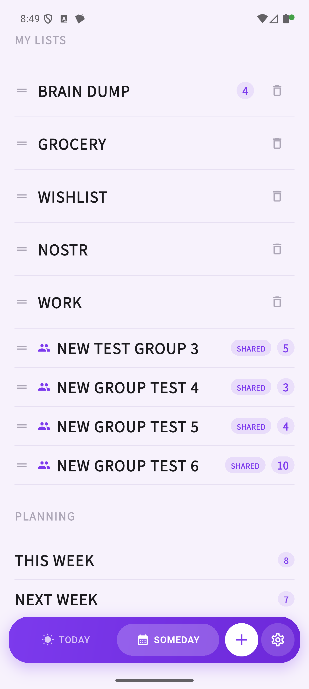

# Meiso

A minimalist task management app built on the Nostr protocol.

[](https://opensource.org/licenses/MIT)
[](https://zapstore.dev/)
[](https://flutter.dev/)
[](https://nostr.com/)

---

## About

**Meiso** (瞑想) is a simple, privacy-focused task management app inspired by TeuxDeux's clean design. Built on the Nostr protocol with end-to-end NIP-44 encryption, your tasks are synced across devices without any central server.

## Features

- **Three-Column Layout**: Today / Tomorrow / Someday organization
- **Subtasks**: Parent-child task relationships with inline editing
- **Recurring Tasks**: Daily, weekly, monthly, yearly patterns with flexible intervals
- **Personal Lists**: Create custom lists to organize tasks by category
- **Image Attachments**: Blossom / NIP-96 image upload with server picker
- **Hide Completed Tasks**: Declutter your view with a single toggle
- **Nostr Sync**: Multi-device synchronization via Nostr relays
- **Privacy First**: NIP-44 end-to-end encryption for all tasks
- **Amber Integration**: Secure key management with Amber signer support
- **NIP-89 Client Tag**: Identify events published by Meiso (opt-out in Settings)
- **Relay User-Agent**: WebSocket handshake includes `meiso/<version>` for relay analytics
- **Dark Mode**: Easy on the eyes day and night
- **Multi-Language**: English, Japanese, Spanish support
- **Drag & Drop**: Intuitive task reordering with drag handle
- **Pull to Refresh**: Quick sync with a simple gesture
- **Go CUI**: Terminal-based task management with bidirectional Nostr sync

## Screenshots

<p align="center">
  
  
  
</p>

## Installation

### Zapstore (Recommended)
Download Meiso from [Zapstore](https://zapstore.dev/) - the Nostr-native app store.

### Build from Source
```bash
# Clone the repository
git clone https://github.com/higedamc/meiso.git
cd meiso

# Install dependencies
fvm flutter pub get

# Build for Android (production flavor)
./generate.sh
fvm flutter build apk --flavor production --release
```

## Tech Stack

- **Frontend**: Flutter 3.x with Riverpod state management
- **Backend Logic**: Rust with flutter_rust_bridge
- **Protocol**: Nostr (NIP-44 encryption, Kind 30001 for tasks, Kind 30078 for settings)
- **Storage**: Local-first with Hive, synced via Nostr relays
- **Architecture**: Feature-based Clean Architecture
- **CUI**: Go (terminal companion app with Nostr sync)

## Architecture

### Collaborative Lists Encryption

Shared lists use a hybrid encryption scheme: task data is encrypted with a
random AES-256-GCM key, and that key is distributed to each member via NIP-44
v2 (ECDH over secp256k1). Members can be added or revoked without
re-encrypting the payload for every change; revocation triggers a full key
rotation to enforce forward secrecy. Event authenticity is guaranteed by
Nostr's Schnorr signatures.

→ **[Full design doc: docs/COLLABORATIVE_LISTS_ENCRYPTION.md](docs/COLLABORATIVE_LISTS_ENCRYPTION.md)**

## Documentation

- **[Development Roadmap](docs/MLS_BETA_ROADMAP.md)** - Upcoming features and MLS group lists
- **[Clean Architecture Guide](docs/REFACTOR_CLEAN_ARCHITECTURE_STRATEGY.md)** - Architecture details
- **[Release Guide](docs/ZAPSTORE_RELEASE_GUIDE_JA.md)** - How to publish to Zapstore (Japanese)
- **[Go CUI MVP Spec](docs/GO_CUI_MVP_SPEC.md)** - macOS supplemental CUI scope and auth model
- **[Go CUI Operation Guide](docs/GO_CUI_OPERATION_GUIDE.md)** - build, E2E flow, and future TUI reuse strategy

## Contributing

Contributions are welcome! Please feel free to submit a Pull Request.

## License

This project is licensed under the MIT License.

## Author

**Kohei Otani**  
Nostr: `npub16lrdq99ng2q4hg5ufre5f8j0qpealp8544vq4ctn2wqyrf4tk6uqn8mfeq`

---

**Powered by Nostr**
