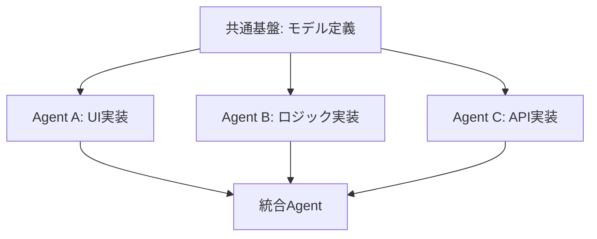

# Git Worktree × Cursor マルチエージェント開発ガイド

複数のCursorエージェントを並行稼働させてgit worktreeで効率的に開発するためのベストプラクティス集

---

## 📋 目次

1. [Git Worktreeの基本](#git-worktreeの基本)
2. [マルチエージェント開発の原則](#マルチエージェント開発の原則)
3. [コンフリクトを防ぐ作業分割戦略](#コンフリクトを防ぐ作業分割戦略)
4. [実践ワークフロー](#実践ワークフロー)
5. [トラブルシューティング](#トラブルシューティング)
6. [統合とマージのベストプラクティス](#統合とマージのベストプラクティス)

---

## Git Worktreeの基本

### Worktreeとは？

Git worktreeは、1つのリポジトリから複数の作業ディレクトリを作成できる機能です。各worktreeは独立したブランチで作業できます。

### 基本コマンド

```bash
# Worktreeを作成
git worktree add <path> <branch-name>

# Worktree一覧を表示
git worktree list

# Worktreeを削除
git worktree remove <path>

# 孤立したWorktreeをクリーンアップ
git worktree prune
```

### Cursor × Worktreeの構成例

```
~/work/meiso/                    # メインworktree (main/fix/app-data)
~/.cursor/worktrees/meiso/
  ├── agent-ui/                  # UIエージェント用
  ├── agent-backend/             # バックエンドエージェント用
  └── agent-feature-a/           # 新機能Aエージェント用
```

---

## マルチエージェント開発の原則

### 🎯 原則1: 明確な責任分離

各エージェントに**明確かつ独立した責任範囲**を割り当てる。

✅ **Good**: 責任範囲が明確
```
- Agent A: UIテーマとスタイリング（lib/app_theme.dart, lib/widgets/）
- Agent B: データマイグレーション（lib/providers/todos_provider.dart, rust/src/）
- Agent C: 新機能追加（lib/features/new_feature/）
```

❌ **Bad**: 重複する責任範囲
```
- Agent A: アプリ設定全般（設定UI + ロジック + API）
- Agent B: データ同期全般（同期UI + ロジック + API）
- Agent C: リレー管理（設定UIにも触る + APIも触る）
→ 全員が同じファイルを編集してコンフリクト！
```

### 🎯 原則2: レイヤー分離

アーキテクチャのレイヤーごとにエージェントを分割する。

```
┌─────────────────────────────────────┐
│ Presentation Layer (UI)             │ ← Agent A
├─────────────────────────────────────┤
│ Business Logic (Providers/Services) │ ← Agent B
├─────────────────────────────────────┤
│ Data/API Layer (Rust/Backend)       │ ← Agent C
└─────────────────────────────────────┘
```

### 🎯 原則3: 機能ごとの垂直分割

1つの機能を1エージェントが担当（UI〜データ層まで）

```
Agent A: ユーザー認証機能
  - lib/presentation/auth/
  - lib/providers/auth_provider.dart
  - rust/src/auth.rs

Agent B: TODO管理機能
  - lib/presentation/todo/
  - lib/providers/todos_provider.dart
  - rust/src/todo.rs

Agent C: 設定機能
  - lib/presentation/settings/
  - lib/providers/settings_provider.dart
  - rust/src/settings.rs
```

---

## コンフリクトを防ぐ作業分割戦略

### 戦略1: ファイル単位の完全分離

**最も安全** - 各エージェントが**完全に異なるファイル**を編集

```yaml
エージェント構成:
  agent-theme:
    担当ファイル:
      - lib/app_theme.dart
      - lib/presentation/settings/theme_settings_screen.dart
    
  agent-migration:
    担当ファイル:
      - lib/providers/todos_provider.dart (マイグレーション部分のみ)
      - lib/services/migration_service.dart (新規作成)
    
  agent-relays:
    担当ファイル:
      - lib/providers/relay_provider.dart (新規作成)
      - lib/presentation/settings/relay_settings_screen.dart (新規作成)
      - rust/src/relay.rs (新規作成)
```

### 戦略2: ディレクトリ単位の分離

各エージェントに**専用ディレクトリ**を割り当て

```
lib/
├── features/
│   ├── auth/           ← Agent A専用
│   ├── todos/          ← Agent B専用
│   └── settings/       ← Agent C専用
├── presentation/
│   ├── auth/           ← Agent A専用
│   ├── todos/          ← Agent B専用
│   └── settings/       ← Agent C専用
```

### 戦略3: 共通ファイルは最後に統合

**どうしても同じファイルを触る必要がある場合**

```markdown
1. Phase 1: 各エージェントが独立部分を完成させる
   - Agent A → ブランチA完成
   - Agent B → ブランチB完成
   - Agent C → ブランチC完成

2. Phase 2: 共通ファイルは1エージェントが統合
   - 全ブランチを順次マージ
   - コンフリクトを解消
   - 統合テスト
```

### 戦略4: 依存関係の事前設計



**実装順序:**
1. **Phase 0**: 共通モデル/インターフェース定義（手動 or 1エージェント）
2. **Phase 1**: 各エージェントが並行作業（依存なし）
3. **Phase 2**: 統合エージェントがマージ

---

## 実践ワークフロー

### 🚀 プロジェクト開始時

#### 1. 作業計画を立てる

```markdown
# 作業計画書

## 目標
アプリ設定機能の追加（NIP-78対応）

## エージェント分割
- **Agent-Model**: データモデル定義
- **Agent-UI**: 設定画面UI
- **Agent-Backend**: Rust API実装

## 依存関係
Agent-Model → Agent-UI
Agent-Model → Agent-Backend

## 実装順序
1. Agent-Model（単独実行、完了後マージ）
2. Agent-UI と Agent-Backend（並行実行）
3. 統合マージ
```

#### 2. Worktree環境をセットアップ

```bash
# メインブランチから開始
cd ~/work/meiso
git checkout fix/app-data

# Phase 0: モデル定義用worktree
git worktree add ~/.cursor/worktrees/meiso/model feature/app-settings-model

# Phase 1: UI用worktree（モデル定義後）
git worktree add ~/.cursor/worktrees/meiso/ui feature/app-settings-ui

# Phase 1: Backend用worktree（モデル定義後）
git worktree add ~/.cursor/worktrees/meiso/backend feature/app-settings-backend
```

#### 3. 各Cursorウィンドウで作業開始

```bash
# ウィンドウ1: モデル定義
cursor ~/.cursor/worktrees/meiso/model

# ウィンドウ2: UI実装
cursor ~/.cursor/worktrees/meiso/ui

# ウィンドウ3: Backend実装
cursor ~/.cursor/worktrees/meiso/backend
```

### 🔄 並行作業中

#### コミット時の注意点

各エージェントは**頻繁に小さくコミット**する：

```bash
# 良いコミット例
git commit -m "feat: Add AppSettings model with freezed"
git commit -m "feat: Add settings screen scaffold"
git commit -m "feat: Add dark mode toggle UI"

# 悪いコミット例（大きすぎ）
git commit -m "feat: Implement entire settings feature"
```

#### 進捗確認

定期的に各ブランチの状態を確認：

```bash
# メインworktreeで実行
cd ~/work/meiso

# 各ブランチの進捗を確認
git log --oneline --graph --all --max-count=20

# コンフリクトの可能性をチェック
git diff feature/app-settings-ui...feature/app-settings-backend --stat
```

### 🔀 統合フェーズ

#### オプション1: 段階的マージ（推奨）

```bash
# メインworktreeに移動
cd ~/work/meiso
git checkout fix/app-data

# 1つずつマージ（依存順）
git merge --no-ff feature/app-settings-model -m "Merge: App settings model"
git merge --no-ff feature/app-settings-backend -m "Merge: App settings backend"
git merge --no-ff feature/app-settings-ui -m "Merge: App settings UI"

# コンフリクトがあれば解消
# git add <resolved-files>
# git commit
```

#### オプション2: Pull Request ベース（大規模プロジェクト向け）

```bash
# 各ブランチをリモートにプッシュ
git push origin feature/app-settings-model
git push origin feature/app-settings-backend
git push origin feature/app-settings-ui

# GitHub/GitLabでPRを作成
# 1. Model → main (レビュー & マージ)
# 2. Backend → main (レビュー & マージ)
# 3. UI → main (レビュー & マージ)
```

---

## トラブルシューティング

### 問題1: 大量のコンフリクトが発生

**原因**: 複数エージェントが同じファイルを編集

**解決策**:

```bash
# 1. 現状を保存
git stash push -m "WIP: Before conflict resolution"

# 2. 各ブランチの変更内容を確認
git log --oneline feature/branch-a
git log --oneline feature/branch-b
git log --oneline feature/branch-c

# 3. 変更ファイルの一覧を確認
git diff main...feature/branch-a --stat
git diff main...feature/branch-b --stat
git diff main...feature/branch-c --stat

# 4. 重複が少ない順にマージ
git merge --no-ff feature/branch-with-least-conflicts
# コンフリクト解消
git merge --no-ff feature/branch-with-medium-conflicts
# コンフリクト解消
git merge --no-ff feature/branch-with-most-conflicts
# コンフリクト解消
```

### 問題2: Worktreeが「孤立」状態

**症状**: `git worktree list` でWorktreeが表示されるが、ディレクトリが存在しない

**解決策**:

```bash
# 孤立したworktreeをクリーンアップ
git worktree prune

# 必要なら再作成
git worktree add <path> <branch>
```

### 問題3: エージェントが古いブランチで作業している

**症状**: マージ済みのブランチをエージェントが編集し続ける

**解決策**:

```bash
# 各worktreeを最新化
cd ~/.cursor/worktrees/meiso/agent-a
git fetch origin
git rebase origin/fix/app-data

cd ~/.cursor/worktrees/meiso/agent-b
git fetch origin
git rebase origin/fix/app-data
```

### 問題4: 「Operation not permitted」エラー

**症状**: Worktree操作時にサンドボックス制限エラー

**解決策**:

```bash
# Cursorターミナルで --required_permissions: ['all'] を使用
# または、システムターミナルで直接実行
```

---

## 統合とマージのベストプラクティス

### ✅ マージ前チェックリスト

```markdown
- [ ] 全ブランチがビルド可能
- [ ] 各ブランチでテストが通る
- [ ] 変更ファイルの重複を確認済み
- [ ] 依存関係の順序を確認済み
- [ ] コミット履歴が整理されている
- [ ] リモートブランチが最新
```

### 🎯 コンフリクト解消の戦略

#### 戦略A: 機能優先度で決定

```
コンフリクト: app_settings.dart

Branch A: ダークモード機能追加 (UI改善)
Branch B: リレーリスト機能追加 (新機能)
Branch C: マイグレーション改善 (バグ修正)

優先度: C > B > A
→ Cをベースに、BとAの変更を追加
```

#### 戦略B: 両方を統合

```dart
// Branch A の変更
class AppSettings {
  final bool darkMode;  // ← A追加
  final int weekStartDay;
}

// Branch B の変更
class AppSettings {
  final int weekStartDay;
  final List<String> relays;  // ← B追加
}

// 統合後
class AppSettings {
  final bool darkMode;        // ← A
  final int weekStartDay;
  final List<String> relays;  // ← B
}
```

#### 戦略C: リファクタリングで分離

```
コンフリクト: 同じファイルに異なる機能を追加

解決策:
1. 機能ごとに別ファイルに分割
2. 各ブランチの変更を該当ファイルに配置
3. 統合ファイルで両方をインポート

Before:
  app_settings.dart (1000行、全機能)

After:
  app_settings.dart (インターフェース)
  theme_settings.dart (Branch A の変更)
  relay_settings.dart (Branch B の変更)
```

### 📊 マージ後の検証

```bash
# 1. ビルドチェック
flutter pub get
flutter pub run build_runner build --delete-conflicting-outputs

# 2. テスト実行
flutter test

# 3. 静的解析
flutter analyze

# 4. 統合動作確認
flutter run

# 5. 各機能の動作確認
# - Branch A の機能が動くか
# - Branch B の機能が動くか
# - Branch C の機能が動くか
# - 機能間の連携が動くか
```

---

## 推奨ワークフロー（まとめ）

### 🎬 理想的な開発フロー

```
1. 計画フェーズ (10分)
   ├─ 機能分割を決定
   ├─ エージェント責任範囲を定義
   ├─ 依存関係を確認
   └─ 実装順序を決定

2. 環境準備 (5分)
   ├─ Worktreeを作成
   ├─ 各Cursorウィンドウを起動
   └─ ブランチ命名規則を確認

3. 並行開発 (数時間〜数日)
   ├─ 各エージェントが独立して作業
   ├─ 小さく頻繁にコミット
   ├─ 定期的に進捗確認
   └─ 必要に応じて責任範囲を調整

4. 統合フェーズ (30分〜2時間)
   ├─ 依存順にブランチをマージ
   ├─ コンフリクトを解消
   ├─ 機能の整合性を確認
   └─ テスト実行

5. クリーンアップ (5分)
   ├─ 不要なworktreeを削除
   ├─ マージ済みブランチを削除
   └─ リモートにプッシュ
```

### 🏆 成功のための3つの鉄則

1. **計画に時間をかける** - 10分の計画が2時間のコンフリクト解消を防ぐ
2. **責任範囲を明確にする** - 曖昧な範囲が重複作業を生む
3. **早めに統合する** - 長期間の並行作業はコンフリクトリスクを高める

---

## 付録: コマンドリファレンス

### Worktree管理

```bash
# Worktree作成（ブランチも同時作成）
git worktree add -b <branch-name> <path>

# Worktree作成（既存ブランチ）
git worktree add <path> <branch-name>

# Worktree一覧
git worktree list

# Worktree削除
git worktree remove <path>

# Worktreeの強制削除
git worktree remove --force <path>

# 孤立worktreeのクリーンアップ
git worktree prune
```

### マージ戦略

```bash
# Fast-forwardなしのマージ（推奨）
git merge --no-ff <branch>

# コンフリクト時に特定ブランチを優先
git merge -X theirs <branch>  # 相手側を優先
git merge -X ours <branch>    # 自分側を優先

# マージを中止
git merge --abort

# マージ後のコミット修正
git commit --amend
```

### ブランチ確認

```bash
# 全ブランチのグラフ表示
git log --oneline --graph --all --max-count=20

# 2つのブランチの差分
git diff branch-a...branch-b

# 変更ファイル一覧
git diff branch-a...branch-b --stat

# 特定ファイルの差分
git diff branch-a branch-b -- path/to/file
```

---

## 実践例: 今回の経験から

### 発生した問題

```
3つのエージェントが並行作業:
- ErloN: アプリデータ同期改善
- TFxpz: マイグレーション + リレー機能
- vMvzc: ダークモード + テーマ調整

結果: app_settings関連ファイルで大量コンフリクト
```

### より良いアプローチ

```yaml
改善案1: 責任範囲の明確化
  ErloN:
    - lib/providers/todos_provider.dart (同期ロジックのみ)
    - 新機能追加なし
  
  TFxpz:
    - lib/providers/todos_provider.dart (マイグレーション部分)
    - lib/providers/relay_provider.dart (新規作成)
    - rust/src/relay.rs (新規作成)
  
  vMvzc:
    - lib/app_theme.dart (完全独立)
    - lib/widgets/ (UI改善のみ)

改善案2: フェーズ分割
  Phase 1: ErloN (バグ修正・改善) → マージ
  Phase 2: TFxpz + vMvzc (並行で新機能) → マージ
  
  → 依存関係が少ないため、コンフリクトが最小化
```

---

## さらなる学習リソース

- [Git Worktree 公式ドキュメント](https://git-scm.com/docs/git-worktree)
- [Pro Git Book - Git Worktree](https://git-scm.com/book/en/v2)
- [Cursor AI Documentation](https://docs.cursor.com/)

---

**作成日**: 2025-10-31  
**バージョン**: 1.0  
**著者**: Meiso Development Team

---

> 💡 **Tip**: このガイドは実践から学んだ経験をまとめたものです。プロジェクトの規模や特性に応じて、適切にカスタマイズしてください。

