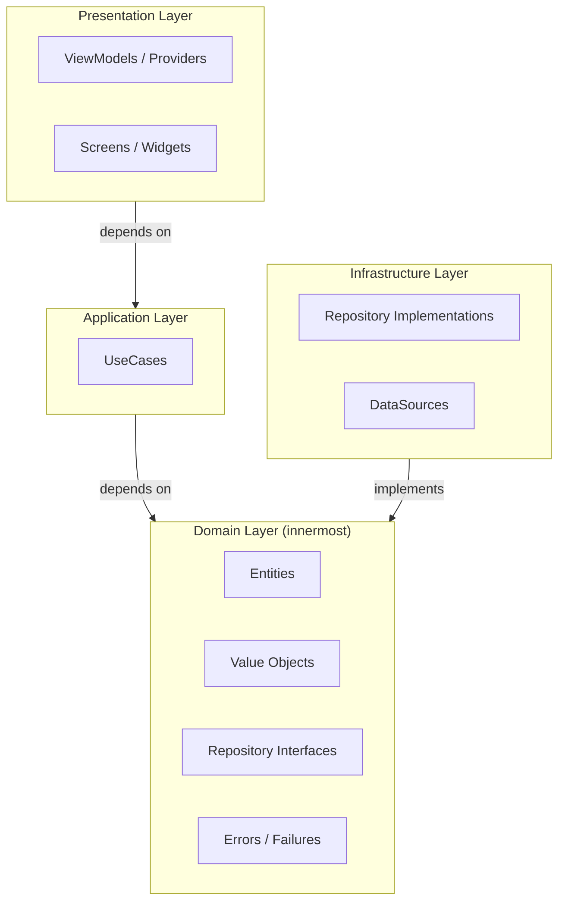
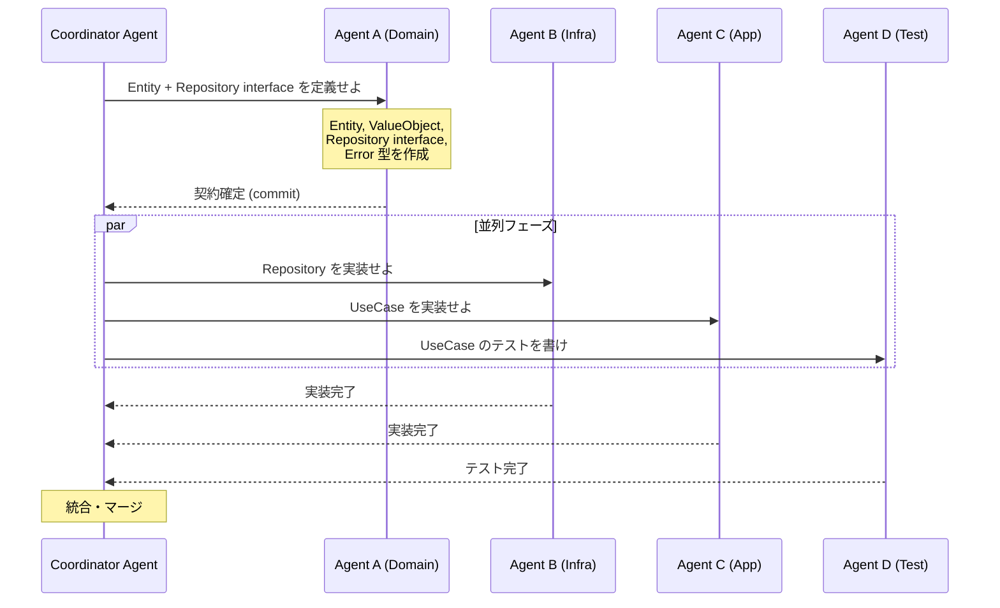
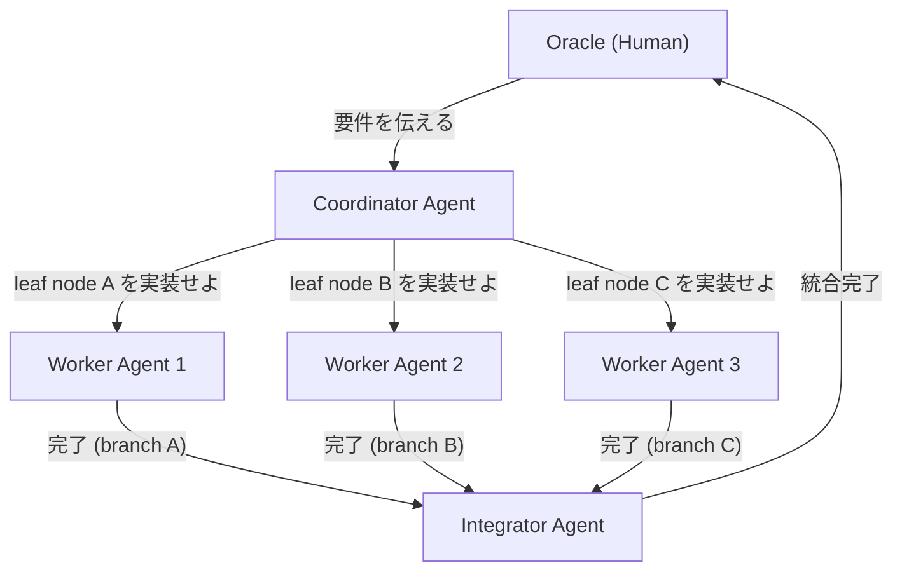

# Leaf Node 並列開発戦略

AI エージェントを複数同時に走らせて開発スループットを最大化するための、leaf node 設計と運用の戦略ドキュメント。

**作成日**: 2026-03-18
**関連ドキュメント**: [GIT_WORKTREE_MULTI_AGENT_GUIDE.md](./GIT_WORKTREE_MULTI_AGENT_GUIDE.md)（実践的な worktree 運用ガイド）

---

## 目次

1. [Leaf Node の定義と原則](#leaf-node-の定義と原則)
2. [Leaf Node の成立条件](#leaf-node-の成立条件)
3. [アーキテクチャレベルの戦略](#アーキテクチャレベルの戦略)
4. [Git レベルの戦略](#git-レベルの戦略)
5. [タスク分解のパターン](#タスク分解のパターン)
6. [実践的なワークフロー](#実践的なワークフロー)
7. [アンチパターン](#アンチパターン)
8. [meiso プロジェクトへの適用例](#meiso-プロジェクトへの適用例)
9. [Leaf Node 設計チェックリスト](#leaf-node-設計チェックリスト)

---

## Leaf Node の定義と原則

### Leaf Node とは

Leaf node とは、**他の並行する作業単位と依存関係を持たない、完全に独立した開発タスク**のことを指す。木構造のメタファーにおいて、leaf（葉）は他のノードの親にならず、他に影響を与えない終端ノードである。

AI 並列開発における leaf node は以下の性質を持つ:

- **ファイル直交性**: 他の並行作業と編集対象ファイルが重複しない
- **状態独立性**: 共有されるミュータブルな状態に依存しない
- **契約先行性**: 入出力のインターフェースが事前に確定している
- **自己完結性**: そのタスク単体でビルド・テストが可能

### なぜ Leaf Node が重要か

```
並列度の理論的上限 = 独立した leaf node の数
```

AI エージェントを同時に N 体走らせても、leaf node が M 個しかなければ `min(N, M)` の並列度しか得られない。マージコンフリクトが発生すれば、その解消時間が並列化の利得を相殺する。

**leaf node を最大化することが、AI 並列開発の投資対効果を最大化する唯一の方法である。**

| 指標 | leaf node 不十分 | leaf node 十分 |
|------|----------------|---------------|
| 並列度 | N エージェント中 1-2 しか有効稼働しない | N エージェント全てが有効稼働 |
| マージコスト | 高（コンフリクト多発） | 低（コンフリクトほぼゼロ） |
| 品質 | 不安定（統合時のデグレ） | 安定（各 leaf が自己完結） |
| 開発者負荷 | 高（監視・調整が必要） | 低（結果をマージするだけ） |

---

## Leaf Node の成立条件

leaf node が成立するには、以下の 3 条件を全て満たす必要がある。

### 条件 1: ファイル直交性

並行する作業同士が**同一ファイルを編集しない**こと。これが最も基本的かつ重要な条件である。

```
Agent A: lib/features/todo/domain/entities/todo.dart        -- OK
Agent B: lib/features/custom_list/domain/entities/list.dart -- OK (別ファイル)
Agent C: lib/features/todo/domain/entities/todo.dart        -- NG (Agent A と衝突)
```

**完全直交**が理想だが、現実にはどうしても共有ファイル（ルーティング定義、DI 設定、エクスポートバレル等）が存在する。その場合は次の戦略で対処する:

1. 共有ファイルへの変更を**最後のフェーズに集約**する
2. 共有ファイルを**1 つのエージェントのみが編集する**ルールにする
3. 共有ファイルを**細分化**して衝突範囲を縮小する

### 条件 2: 状態独立性

並行する作業同士が**共有されるミュータブルな状態を操作しない**こと。ファイルが異なっても、同じグローバル状態やデータベーステーブルを操作する場合は事実上の依存関係が生まれる。

```
// これは leaf node にならない:
Agent A: UserProvider に isLoggedIn フィールドを追加
Agent B: AuthService で isLoggedIn を参照するロジックを変更
// → Agent A の変更が Agent B の前提を壊す可能性がある
```

### 条件 3: 契約先行性

leaf node が依存する**インターフェース（契約）が事前に確定**していること。実装の詳細に依存するのではなく、抽象に依存することで独立性を確保する。

```dart
// 契約（interface）が先に確定していれば:
abstract class TodoRepository {
  Future<Either<Failure, Todo>> createTodo(Todo todo);
}

// Agent A: TodoRepository の実装を書く (infrastructure)
// Agent B: TodoRepository を使う UseCase を書く (application)
// → 互いの実装詳細を知らなくても並列作業が可能
```

---

## アーキテクチャレベルの戦略

### Clean Architecture のレイヤー境界が生む自然な leaf node

Clean Architecture の各レイヤーは依存関係の方向が一方向に制約されている。この性質を利用して、レイヤーごとに独立した leaf node を生成できる。



**Leaf node 化の手順**:

1. **Phase 0 (Coordinator)**: Domain Layer のインターフェースを定義する（Entity、Repository interface、Error 型）
2. **Phase 1 (並列)**: Application Layer（UseCase）と Infrastructure Layer（Repository 実装）を別エージェントが担当
3. **Phase 2 (並列)**: Presentation Layer（ViewModel、Screen）をさらに別エージェントが担当
4. **Phase 3 (統合)**: 全レイヤーを結合し、DI 設定とテストを実行

### Feature-based 構造がもたらす自然な leaf node

Feature-based アーキテクチャでは、各 feature が独立したディレクトリツリーを持つ。feature 間に依存関係がなければ、各 feature がそのまま leaf node になる。

```
lib/features/
├── todo/           ← Agent A の担当 (leaf node 1)
│   ├── domain/
│   ├── application/
│   ├── infrastructure/
│   └── presentation/
│
├── custom_list/    ← Agent B の担当 (leaf node 2)
│   ├── domain/
│   ├── application/
│   ├── infrastructure/
│   └── presentation/
│
└── mls/            ← Agent C の担当 (leaf node 3)
    ├── domain/
    ├── application/
    └── infrastructure/
```

**注意**: feature 間に暗黙の依存関係がある場合（例: custom_list が todo の Entity を参照する）、完全な leaf node にはならない。この場合は共有 Entity を `lib/core/` や `lib/models/` に抽出し、先行して確定させる。

### Interface-first（契約先行）設計

並列開発の鍵は**実装の前にインターフェースを確定させること**である。



**契約先行で確定させるべきもの**:

| 確定対象 | 具体例 | 理由 |
|---------|--------|------|
| Entity / Model | `Todo`, `CustomList`, `MlsGroup` | 全レイヤーが参照する共通データ型 |
| Repository interface | `TodoRepository`, `CustomListRepository` | Application と Infrastructure の境界契約 |
| Error / Failure 型 | `TodoFailure`, `CustomListError` | エラーハンドリングの統一に必要 |
| UseCase の入出力型 | `CreateTodoParams` → `Either<Failure, Todo>` | テストとモックの基盤 |

---

## Git レベルの戦略

### git worktree による物理的分離

`git worktree` は 1 つのリポジトリから複数の作業ディレクトリを作る機能で、leaf node の物理的な分離を実現する。詳細な操作方法は [GIT_WORKTREE_MULTI_AGENT_GUIDE.md](./GIT_WORKTREE_MULTI_AGENT_GUIDE.md) を参照。

```bash
# leaf node ごとに worktree を作成
git worktree add ~/.cursor/worktrees/meiso/leaf-domain  -b leaf/domain-contracts
git worktree add ~/.cursor/worktrees/meiso/leaf-todo    -b leaf/todo-usecase
git worktree add ~/.cursor/worktrees/meiso/leaf-list    -b leaf/list-repository
git worktree add ~/.cursor/worktrees/meiso/leaf-mls     -b leaf/mls-domain
```

各 Cursor ウィンドウで worktree を開くことで、エージェント同士のファイルシステムレベルの干渉が完全に排除される。

### ブランチ命名規則

leaf node を管理しやすいブランチ命名規則:

```
leaf/<feature>-<layer>-<task>

例:
leaf/todo-domain-entities          # Todo feature の Entity 定義
leaf/todo-app-create-usecase       # Todo feature の CreateTodoUseCase
leaf/list-infra-repository         # CustomList feature の Repository 実装
leaf/mls-domain-key-package-policy # MLS feature の KeyPackagePublishPolicy
```

### マージ戦略: 依存順マージ

leaf node のマージは**依存関係の方向に従って**行う。内側（Domain）から外側（Presentation）へ。

```bash
# 1. Domain layer を先にマージ
git merge --no-ff leaf/todo-domain-entities
git merge --no-ff leaf/list-domain-entities
git merge --no-ff leaf/mls-domain-key-package-policy

# 2. Application / Infrastructure layer をマージ
git merge --no-ff leaf/todo-app-create-usecase
git merge --no-ff leaf/list-infra-repository

# 3. Presentation layer を最後にマージ
git merge --no-ff leaf/todo-pres-viewmodel
```

---

## タスク分解のパターン

### Pattern 1: 新規ファイル作成型（安全度: 最高）

**既存ファイルに一切触れず、新しいファイルのみを作成する**タスク。これが最も安全な leaf node であり、コンフリクトリスクがゼロである。

適用例:

| タスク | 作成するファイル | 既存への影響 |
|--------|----------------|------------|
| 新しい UseCase を書く | `create_todo_usecase.dart` | なし |
| 新しい Entity を定義する | `key_package.dart` | なし |
| テストを書く | `create_todo_usecase_test.dart` | なし |
| ドキュメントを書く | `MLS_BETA_ROADMAP.md` | なし |

**運用ルール**: 新規ファイル作成型タスクは、他のパターンに優先して leaf node として切り出す。

### Pattern 2: レイヤー分割型（安全度: 高）

1 つの feature を**レイヤーごとに分割**して、各レイヤーを別のエージェントが担当する。

```
Feature: Todo のリカーリングタスク機能

  leaf node A: Domain 層
    - RecurrencePattern (Entity)
    - RecurrenceRepository (interface)
    - RecurrenceError (Failure)

  leaf node B: Application 層
    - GenerateRecurringInstancesUseCase
    - RemoveChildInstancesUseCase

  leaf node C: Infrastructure 層
    - RecurrenceRepositoryImpl
    - RecurrenceLocalDataSource

  leaf node D: Test 層
    - generate_recurring_instances_test.dart
    - remove_child_instances_test.dart
```

**前提条件**: Domain 層（leaf node A）が先に完了し、コミットされている必要がある。leaf node B/C/D はその後で並列実行可能。

### Pattern 3: Feature 分割型（安全度: 高）

**異なる feature を丸ごと別のエージェントに割り当てる**。Feature-based アーキテクチャで最も自然なパターン。

```
leaf node A: Todo feature 全体
  lib/features/todo/**

leaf node B: CustomList feature 全体
  lib/features/custom_list/**

leaf node C: MLS feature 全体
  lib/features/mls/**
```

**注意**: feature 間の共有依存（`lib/core/`, `lib/models/`）は事前に確定させておくこと。

### Pattern 4: テスト分離型（安全度: 高）

**実装とテストを別のエージェントに割り当てる**。テストファイルは実装ファイルと完全に異なるパスに存在するため、ファイル直交性が保証される。

```
leaf node A: 実装
  lib/features/todo/application/usecases/create_todo_usecase.dart

leaf node B: テスト
  test/features/todo/application/usecases/create_todo_usecase_test.dart
```

**前提条件**: テストエージェントには、実装の契約（interface、入出力型）が事前に共有されている必要がある。TDD の場合はテストエージェントが先行する。

### Pattern 5: 技術スタック分割型（安全度: 最高）

**完全に異なる技術スタック**を並列開発する。ファイル直交性だけでなく、ビルドシステムも完全に独立している。

```
leaf node A: Flutter (Dart)
  lib/**

leaf node B: Rust backend
  rust/src/**

leaf node C: Go CLI
  cui/**
```

### Vertical Slice vs Horizontal Slice

| 分割方式 | 説明 | 向いている場面 | leaf node 安全度 |
|---------|------|-------------|----------------|
| Vertical Slice | 1 feature を丸ごと（全レイヤー） | 独立した新機能の追加 | 高（feature 間に依存がなければ） |
| Horizontal Slice | 1 レイヤーを横断的に | 既存コードのリファクタリング | 中（共有ファイルに注意） |

**推奨**: 新機能は Vertical Slice、リファクタリングは Horizontal Slice で leaf node を設計する。

---

## 実践的なワークフロー

### Coordinator パターン

最も効果的なワークフローは **1 つのエージェント（Coordinator）が設計と分割を担い、複数のエージェント（Worker）が実装を担当する**パターンである。



**Coordinator の責務**:

1. 要件を分析し、leaf node を特定する
2. 各 leaf node の入出力契約（interface）を定義する
3. 契約ファイルをコミットする（Phase 0）
4. 各 Worker に明確な指示を与える（どのファイルを作成/編集するか）
5. 統合時のマージ順序を決定する

**Worker の責務**:

1. 割り当てられた leaf node のみを実装する
2. 指定されたファイル以外は編集しない
3. 自己完結するコミットを作成する
4. lint エラーがないことを確認する

### 契約先行コミットのワークフロー

```bash
# Phase 0: Coordinator が契約を定義してコミット
git checkout -b contracts/feature-x
# Entity, Repository interface, Error 型を作成
git add lib/features/x/domain/
git commit -m "update: Feature X domain contracts (Entity, Repository interface, Error)"
git checkout main && git merge --no-ff contracts/feature-x

# Phase 1: 契約確定後、各 Worker が leaf node ブランチを切る
git worktree add ~/.cursor/worktrees/meiso/leaf-x-app  -b leaf/x-usecases
git worktree add ~/.cursor/worktrees/meiso/leaf-x-infra -b leaf/x-repository
git worktree add ~/.cursor/worktrees/meiso/leaf-x-test  -b leaf/x-tests

# Phase 2: 各 Worker が独立して作業 (並列)

# Phase 3: Integrator がマージ
git merge --no-ff leaf/x-usecases
git merge --no-ff leaf/x-repository
git merge --no-ff leaf/x-tests
```

### 統合フェーズの手順

統合フェーズで起きる問題を最小化するためのルール:

1. **依存の内側からマージ**: Domain -> Application -> Infrastructure -> Presentation
2. **1 ブランチずつマージ**: 一度に全部マージしない。1 つマージしたらビルド確認する
3. **DI 設定は最後**: Provider の登録やルーティングの追加は全レイヤーがマージされた後に行う
4. **統合テストは最後**: 各 leaf node のユニットテストが通ることを先に確認する

---

## アンチパターン

### Anti-pattern 1: God File への同時編集

**問題**: 複数のエージェントが同じ巨大ファイルを編集する。

```
Agent A: lib/providers/todos_provider.dart の addTodo() を修正
Agent B: lib/providers/todos_provider.dart の syncFromNostr() を修正
Agent C: lib/providers/todos_provider.dart の deleteTodo() を修正
→ 3 エージェントが 3,500 行のファイルを同時編集 → コンフリクト地獄
```

**対策**: God File をリファクタリングして責務ごとに分割するか、1 つの God File は 1 エージェントのみが担当するルールにする。本質的な解決は God File を生まないアーキテクチャにすること。

### Anti-pattern 2: 暗黙の依存関係

**問題**: ファイルは異なるが、片方の変更がもう片方の前提を壊す。

```dart
// Agent A が AppSettings モデルにフィールドを追加
class AppSettings {
  final bool darkMode;
  final String locale;
  final int syncInterval; // 追加
}

// Agent B が AppSettings の JSON パースを書いている（古いフィールドセットで）
AppSettings.fromJson(Map<String, dynamic> json) {
  return AppSettings(
    darkMode: json['darkMode'] ?? false,
    locale: json['locale'] ?? 'en',
    // syncInterval が漏れる
  );
}
```

**対策**: freezed や json_serializable のようなコード生成に依存する型は、1 つのエージェントが Entity 定義とコード生成を一括で担当する。

### Anti-pattern 3: 共有状態の並行操作

**問題**: 異なるファイルから同じ状態（Provider, DB テーブル）を操作する。

```dart
// Agent A: lib/features/todo/presentation/todo_screen.dart
ref.read(todosProvider.notifier).addTodo(newTodo);

// Agent B: lib/features/sync/infrastructure/sync_service.dart
ref.read(todosProvider.notifier).syncFromRemote();

// → addTodo と syncFromRemote が同時に state を更新すると競合
```

**対策**: 状態を操作する経路を 1 つに絞る（UseCase 経由のみ等）。もしくは、状態操作するコード自体を leaf node として分離し、並列化しない。

### Anti-pattern 4: エクスポートバレル（barrel file）の同時編集

**問題**: `index.dart` や `exports.dart` のようなバレルファイルに全員が export を追加する。

```dart
// lib/features/todo/domain/domain.dart (バレルファイル)
export 'entities/todo.dart';           // Agent A が追加
export 'entities/recurrence.dart';     // Agent B が追加
export 'repositories/todo_repo.dart';  // Agent C が追加
// → 全員が同じファイルの同じ付近に行を追加 → コンフリクト
```

**対策**: バレルファイルへの追加は統合フェーズで 1 エージェントが一括で行う。もしくはバレルファイル自体を使わず、各ファイルを直接 import する。

---

## meiso プロジェクトへの適用例

### 例 1: UseCase 抽出を leaf node として並列化

meiso の Phase B（UseCase 抽出）を leaf node パターンで再設計した場合:

```
Phase 0 (Coordinator):
  確定する契約:
    - lib/core/common/usecase.dart (既存)
    - lib/core/common/failure.dart (既存)
    - lib/features/todo/domain/repositories/todo_repository.dart (interface)

Phase 1 (並列):
  leaf node A: CreateTodoUseCase
    作成: lib/features/todo/application/usecases/create_todo_usecase.dart
    作成: test/features/todo/application/usecases/create_todo_usecase_test.dart

  leaf node B: UpdateTodoUseCase
    作成: lib/features/todo/application/usecases/update_todo_usecase.dart
    作成: test/features/todo/application/usecases/update_todo_usecase_test.dart

  leaf node C: DeleteTodoUseCase
    作成: lib/features/todo/application/usecases/delete_todo_usecase.dart
    作成: test/features/todo/application/usecases/delete_todo_usecase_test.dart

  leaf node D: GenerateRecurringInstancesUseCase
    作成: lib/features/todo/application/usecases/generate_recurring_instances_usecase.dart
    作成: test/.../generate_recurring_instances_usecase_test.dart

Phase 2 (統合):
  1 エージェントが全 UseCase をマージ
  DI 設定 (usecase_providers.dart) を更新
  TodosProvider の各メソッドを UseCase 呼び出しに変更
```

**効果**: 4 つの UseCase を 4 エージェントが同時に書ける。Phase 1 の時間が 1/4 になる。

### 例 2: Rust backend と Flutter frontend の自然な分離

meiso の技術スタック構成は leaf node の宝庫:

```
leaf node A: Rust backend (rust/src/)
  - Nostr プロトコル処理
  - NIP-44 暗号化
  - MLS プロトコル
  - ビルド: cargo build

leaf node B: Flutter frontend (lib/)
  - UI/UX
  - 状態管理
  - ビジネスロジック
  - ビルド: flutter build

leaf node C: Go CLI (cui/)
  - コマンドラインインターフェース
  - ビルド: go build
```

3 つの技術スタックは完全に独立しており、各エージェントが同時に開発できる。唯一の接点は `flutter_rust_bridge` の FFI 定義だが、これは契約先行設計で対処可能:

```
Phase 0: FFI interface を確定 (rust/src/api.rs の pub fn 定義)
Phase 1: Rust 実装と Flutter 呼び出し側を並列開発
```

### 例 3: Provider リファクタリングの leaf node 化

巨大な `todos_provider.dart`（3,500+ 行）のリファクタリングを leaf node 化する戦略:

```
課題: 3,500 行の God Provider を Clean Architecture 化したい
制約: Provider の公開 API（メソッドシグネチャ）は変更しない

Phase 0 (契約確定):
  - TodoRepository interface を定義
  - CustomListRepository interface を定義
  - Error 型を定義

Phase 1 (新規ファイル作成 = 安全な leaf node):
  leaf node A: TodoRepositoryImpl (新規ファイル)
  leaf node B: CustomListRepositoryImpl (新規ファイル)
  leaf node C: 各 UseCase (新規ファイル x N)
  leaf node D: 各テスト (新規ファイル x N)

Phase 2 (God File の改修 = 1 エージェントのみ):
  todos_provider.dart の内部を UseCase 呼び出しに置き換え
  → この作業は並列化しない（God File は 1 エージェント）

Phase 3 (テスト):
  統合テストを実行
```

**核心**: God File の編集は並列化を諦め、**それ以外の全てを leaf node 化**する。新規ファイル作成は最も安全な leaf node であり、ここに並列性を集中させる。

---

## Leaf Node 設計チェックリスト

タスクを leaf node として切り出す前に確認する項目:

### 分割前

- [ ] タスク全体の依存関係グラフを描いたか？
- [ ] 共有される Entity / Model は先に確定しているか？
- [ ] Repository interface は先に確定しているか？
- [ ] Error / Failure 型は先に確定しているか？
- [ ] 各 leaf node が編集するファイル一覧を列挙したか？
- [ ] ファイル一覧に重複はないか？（重複があれば leaf node ではない）

### 各 leaf node の検証

- [ ] この leaf node は他の並行作業のファイルに触れないか？
- [ ] この leaf node は共有ミュータブル状態を操作しないか？
- [ ] この leaf node は単体でビルドできるか？
- [ ] この leaf node は単体でテストできるか？
- [ ] この leaf node の完了条件は明確か？

### 統合フェーズ

- [ ] マージ順序は依存関係の内側（Domain）からか？
- [ ] 各マージ後にビルド確認を行うか？
- [ ] DI 設定（Provider 登録）は全レイヤーマージ後に行うか？
- [ ] 統合テストを最後に実行するか？

---

## まとめ: Leaf Node 最大化の 5 原則

1. **契約を先に決める**: Entity、interface、Error 型を最初にコミットする。これが全ての並列作業の土台になる

2. **新規ファイル作成を優先する**: 既存ファイルの編集よりも新規ファイルの作成の方が安全。リファクタリングでも「新しいファイルに抽出 → 古いファイルから呼び出す」の順序で進める

3. **God File には 1 エージェントのみ**: 巨大なファイルへの同時編集は避けられないコンフリクトを生む。並列性は新規ファイル側に集中させる

4. **Feature 境界を尊重する**: Feature-based アーキテクチャの feature 間境界は天然の leaf node 境界。feature 間の依存は `lib/core/` に抽出して先に確定させる

5. **統合は内側から**: Domain -> Application -> Infrastructure -> Presentation の順でマージする。依存の方向に逆らってマージするとビルドが壊れる

---

**改訂履歴**:
- 2026-03-18: 初版作成
