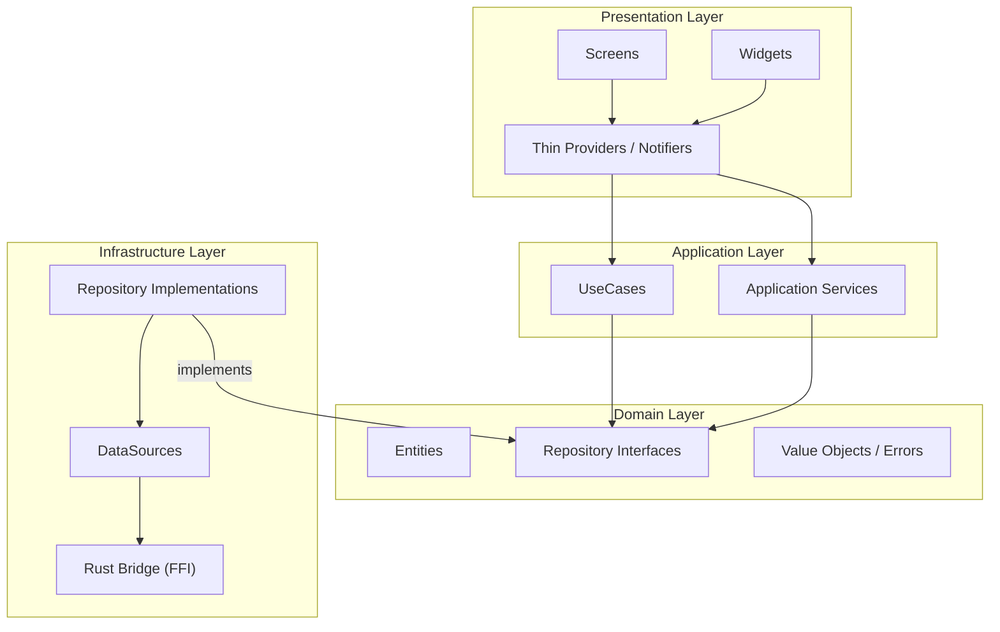
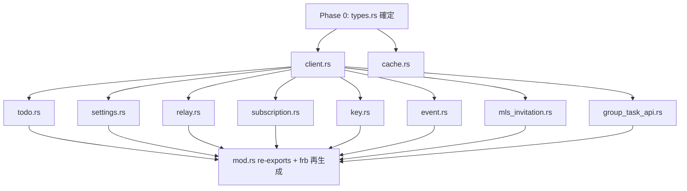
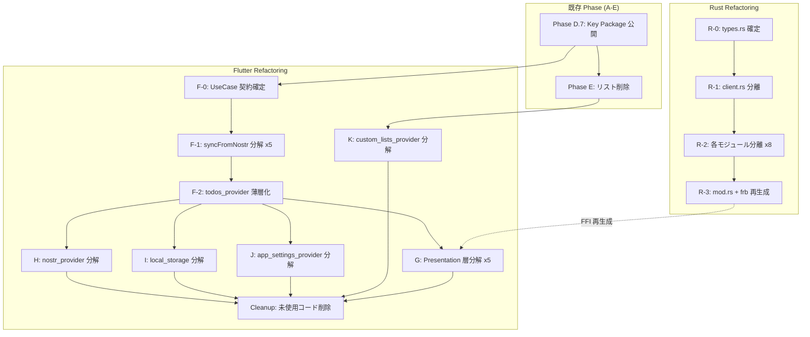

# Refactoring Master Plan

コードベース全体のリファクタリング戦略。God File の解体、Clean Architecture 準拠、Leaf Node 並列開発への対応を包括的に計画する。

**作成日**: 2026-03-22
**関連ドキュメント**:
- [LEAF_NODE_PARALLEL_DEVELOPMENT_STRATEGY.md](./LEAF_NODE_PARALLEL_DEVELOPMENT_STRATEGY.md) -- 並列開発の原則
- [REFACTOR_CLEAN_ARCHITECTURE_STRATEGY.md](./REFACTOR_CLEAN_ARCHITECTURE_STRATEGY.md) -- 既存リファクタリング方針（Phase A-E）
- [CLEAN_ARCHITECTURE_IMPLEMENTATION_STATUS.md](./CLEAN_ARCHITECTURE_IMPLEMENTATION_STATUS.md) -- 進捗状況

---

## 目次

1. [現状分析: スパゲッティコードマップ](#1-現状分析-スパゲッティコードマップ)
2. [Rust api.rs 分解計画](#2-rust-apirs-分解計画)
3. [Flutter God File 分解計画](#3-flutter-god-file-分解計画)
4. [Clean Architecture 違反の是正](#4-clean-architecture-違反の是正)
5. [Leaf Node 並列化分析](#5-leaf-node-並列化分析)
6. [Phase 依存関係と実行順序](#6-phase-依存関係と実行順序)
7. [既存戦略との統合](#7-既存戦略との統合)

---

## 1. 現状分析: スパゲッティコードマップ

### 1.1 概要

コードベース全体で **27,896行** が God File（500行以上の手書きファイル）に集中している。特に Rust 側の `api.rs`（4,688行）と Flutter 側の `todos_provider.dart`（6,294行）が最大のボトルネックである。

### 1.2 Rust 側 (`rust/src/`)

全ファイルがフラットに配置されており、サブディレクトリもレイヤー構造も存在しない。

| ファイル | 行数 | 責務 | 問題 |
|----------|------|------|------|
| **api.rs** | **4,688** | FFI facade（109 pub 関数） | 10以上の責務が混在する God File |
| mls.rs | 638 | MLS プロトコル処理 | 適正範囲 |
| group_tasks.rs | 501 | NIP-72 グループタスク暗号化 | 適正範囲 |
| group_tasks_mls.rs | 419 | MLS グループタスク | 適正範囲 |
| key_store.rs | 292 | 安全な鍵保存（Argon2 + AES-256-GCM） | 適正範囲 |
| lib.rs | 17 | モジュール宣言 + グローバル状態 | 適正 |
| frb_generated.rs | 7,615 | flutter_rust_bridge 自動生成 | 自動生成（対象外） |

**`api.rs` の責務分析**（109 pub 関数の内訳）:

| 責務カテゴリ | 行範囲（概算） | pub 関数数 | 行数 |
|-------------|---------------|-----------|------|
| 型定義（TodoData, AppSettings 等） | 1-240 | - | ~240 |
| MLS イベント取得 | 242-362 | 4 | ~120 |
| MeisoNostrClient（impl） | 363-1452 | 18 | ~1,090 |
| クライアント初期化 | 1454-1556 | 6 | ~100 |
| 鍵生成・取得 | 1559-1656 | 6 | ~100 |
| 鍵ストア操作 | 1658-1736 | 7 | ~80 |
| Amber・署名関連 | 1738-2013 | 8 | ~275 |
| Todo 暗号化・取得 | 2015-2945 | 22 | ~930 |
| 型変換ユーティリティ | 2946-2974 | 2 | ~30 |
| AppSettings 操作 | 2975-3133 | 7 | ~160 |
| リレー管理 | 3135-3177 | 6 | ~40 |
| イベント削除・検索 | 3178-3380 | 6 | ~200 |
| Subscription 管理 | 3381-3491 | 10 | ~110 |
| キャッシュ操作 | 3493-3548 | 2 | ~55 |
| グループタスク API | 3550-4046 | 5 | ~500 |
| MLS 招待 API | 4047-4688 | 6 | ~640 |

### 1.3 Flutter 側 (`lib/`)

God File 一覧（手書き、500行以上）:

| カテゴリ | ファイル | 行数 | 責務数 | 深刻度 |
|---------|---------|------|-------|--------|
| **Provider** | `todos_provider.dart` | **6,294** | 15+ | Critical |
| **Provider** | `custom_lists_provider.dart` | **2,370** | 8+ | Critical |
| **Provider** | `nostr_provider.dart` | **1,803** | 6+ | High |
| **Provider** | `app_settings_provider.dart` | 676 | 4 | Medium |
| **Screen** | `someday_screen.dart` | 1,333 | 5+ | High |
| **Screen** | `settings_screen.dart` | 1,163 | 6+ | High |
| **Screen** | `secret_key_management_screen.dart` | 1,020 | 4+ | High |
| **Screen** | `app_settings_detail_screen.dart` | 983 | 4+ | High |
| **Screen** | `cryptography_detail_screen.dart` | 860 | 3+ | Medium |
| **Screen** | `login_screen.dart` | 826 | 5+ | High |
| **Widget** | `add_group_list_dialog.dart` | 1,036 | 4+ | High |
| **Widget** | `todo_edit_screen.dart` | 875 | 4+ | High |
| **Widget** | `todo_item.dart` | 766 | 3+ | Medium |
| **Service** | `local_storage_service.dart` | 817 | 6+ | Medium |
| **Widget** | `expandable_custom_list_modal.dart` | 519 | 3 | Low |

**合計**: 手書き God File **19,341行**

### 1.4 Clean Architecture 違反マップ

```
[Presentation] ──直接参照──> [Rust API]        (login_screen, settings_screen, mls_backup_dialog)
[Presentation] ──直接参照──> [LocalStorage]     (todo_edit_screen, secret_key_management_screen)
[Widget]       ──ビジネスロジック内包──>         (todo_item, day_page)
[Provider]     ──全責務内包──> [God Provider]   (todos_provider: CRUD + Sync + MLS + Migration)
[features/]    ──未使用──> [ViewModel]          (TodoListViewModel, CustomListViewModel)
```

### 1.5 Leaf Node 並列開発の阻害要因

現在のコードベースで並列開発が困難な理由:

| 阻害要因 | 該当ファイル | 影響 |
|---------|------------|------|
| God File への集中 | `api.rs`, `todos_provider.dart` | 複数エージェントが同一ファイルを編集不可 |
| 暗黙の依存関係 | Provider 間の `_ref.read()` | 変更が他 Provider に波及 |
| 共有ミュータブル状態 | `NOSTR_CLIENTS` (Rust) | クライアント状態の競合 |
| Interface 未定義 | Rust 側に Repository/Service 境界なし | 契約先行開発が不可能 |
| バレルファイル的構造 | `api.rs` が全関数のエントリポイント | 全変更が 1 ファイルに集中 |

---

## 2. Rust api.rs 分解計画

### 2.1 目標

`api.rs`（4,688行、109 pub 関数）をモジュール構造に分解し、各モジュールを **200-600行** に収める。`flutter_rust_bridge` との互換性を維持しつつ、責務ごとに独立したファイルにする。

### 2.2 提案ディレクトリ構造

```
rust/src/
  api/
    mod.rs              # re-exports + TOKIO_RUNTIME + get_client ヘルパー
    types.rs            # 共有型: TodoData, AppSettings, EventSendResult, CachedEventInfo 等
    client.rs           # MeisoNostrClient struct + impl（init, mode, keys 等）
    todo.rs             # Todo CRUD + 暗号化 + fetch 系関数
    settings.rs         # AppSettings save/sync/fetch + 暗号化イベント作成
    relay.rs            # リレー管理（save/sync/update）
    subscription.rs     # Subscription 開始/停止/受信 + 接続状態
    cache.rs            # CachedEventInfo 操作
    key.rs              # 鍵生成、鍵ストア操作、Amber 署名関連
    event.rs            # イベント署名、送信、削除、検索
    mls_invitation.rs   # MLS 招待（作成、同期、Key Package 取得）
    group_task_api.rs   # グループタスク暗号化/復号化 API
  group_tasks.rs        # (既存: 変更なし)
  group_tasks_mls.rs    # (既存: 変更なし)
  key_store.rs          # (既存: 変更なし)
  mls.rs                # (既存: 変更なし)
  lib.rs                # モジュール宣言更新
```

### 2.3 各モジュールの責務と行数見込み

| モジュール | 主な責務 | 元の行範囲 | 見込み行数 | pub 関数数 |
|-----------|---------|-----------|-----------|-----------|
| `types.rs` | TodoData, AppSettings, EventSendResult, CachedEventInfo, SubscriptionInfo, ReceivedEvent, KeyPair, EncryptedTodoListEvent, TodoListMetadata, TodoListName, EncryptedTodoEvent, EncryptedAppSettingsEvent + ヘルパー関数 | 1-240, 散在 | ~350 | 0 (型のみ) |
| `client.rs` | MeisoNostrClient struct + 18 impl メソッド + MLS イベント取得 | 242-1452 | ~500 | 4 + 18 impl |
| `mod.rs` | TOKIO_RUNTIME, get_client(), クライアント初期化関数 | 1454-1556 | ~150 | 6 |
| `todo.rs` | Todo CRUD、暗号化、fetch 系 22 関数 | 1613-2945 | ~600 | 22 |
| `key.rs` | 鍵生成、鍵ストア操作 7 関数、Amber 署名、イベント署名 | 1559-2013 | ~450 | 16 |
| `event.rs` | イベント送信、削除、検索 | 1963-3380 | ~250 | 8 |
| `settings.rs` | AppSettings save/sync/fetch + 暗号化イベント作成 | 2975-3133 | ~160 | 7 |
| `relay.rs` | リレー管理 | 3135-3177 | ~50 | 6 |
| `subscription.rs` | Subscription ライフサイクル + 接続状態 | 3381-3491 | ~120 | 10 |
| `cache.rs` | キャッシュ操作 | 3493-3548 | ~60 | 2 |
| `group_task_api.rs` | グループタスク暗号化/復号化 | 3550-4046 | ~500 | 5 |
| `mls_invitation.rs` | MLS 招待・Key Package | 4047-4688 | ~640 | 6 |

### 2.4 flutter_rust_bridge 互換性の維持

`flutter_rust_bridge` は `pub fn` を走査して Dart バインディングを生成する。モジュール分割後も以下を満たす必要がある:

1. **全 pub 関数を `mod.rs` で re-export**: `pub use` で各サブモジュールの関数を公開
2. **pub struct/enum も re-export**: `TodoData`, `AppSettings` 等の型も同様
3. **`frb_generated.rs` の再生成**: `flutter_rust_bridge_codegen generate` を実行

```rust
// api/mod.rs
pub mod types;
pub mod client;
pub mod todo;
pub mod settings;
pub mod relay;
pub mod subscription;
pub mod cache;
pub mod key;
pub mod event;
pub mod mls_invitation;
pub mod group_task_api;

pub use types::*;
pub use client::*;
pub use todo::*;
pub use settings::*;
pub use relay::*;
pub use subscription::*;
pub use cache::*;
pub use key::*;
pub use event::*;
pub use mls_invitation::*;
pub use group_task_api::*;

// 共有ランタイムとヘルパー
static TOKIO_RUNTIME: once_cell::sync::Lazy<tokio::runtime::Runtime> =
    once_cell::sync::Lazy::new(|| {
        tokio::runtime::Runtime::new().expect("Failed to create Tokio runtime")
    });

pub(crate) async fn get_client(client_id: Option<String>) -> anyhow::Result<client::MeisoNostrClient> {
    let id = client_id.unwrap_or_else(|| crate::DEFAULT_CLIENT_ID.to_string());
    let clients = crate::NOSTR_CLIENTS.lock().await;
    clients
        .get(&id)
        .cloned()
        .with_context(|| format!("Nostr client [{}] not initialized", id))
}
```

```rust
// lib.rs (更新後)
mod frb_generated;
use std::collections::HashMap;
use std::sync::Arc;
use tokio::sync::Mutex;

pub mod api;       // api/ ディレクトリ
pub mod key_store;
pub mod group_tasks;
pub mod mls;
pub mod group_tasks_mls;

pub static NOSTR_CLIENTS: once_cell::sync::Lazy<Arc<Mutex<HashMap<String, api::client::MeisoNostrClient>>>> =
    once_cell::sync::Lazy::new(|| Arc::new(Mutex::new(HashMap::new())));

pub const DEFAULT_CLIENT_ID: &str = "default";
```

### 2.5 実行手順

| Step | 内容 | リスク | 検証方法 |
|------|------|--------|---------|
| 1 | `api/` ディレクトリ作成、`types.rs` に型を移動 | 低 | `cargo check` |
| 2 | `client.rs` に MeisoNostrClient を移動 | 中 | `cargo check` |
| 3 | `mod.rs` にランタイム + get_client + re-exports | 中 | `cargo check` |
| 4 | 残りのモジュールを順次分離 | 低（各モジュール独立） | `cargo check` per module |
| 5 | `frb_generated.rs` 再生成 | 中 | `flutter_rust_bridge_codegen generate` |
| 6 | Flutter 側の `import` が変わらないことを確認 | 低 | `flutter build` |

**重要**: Step 5 で `flutter_rust_bridge_codegen generate` を実行すれば、Flutter 側の `lib/src/rust/api.dart` が自動再生成される。Flutter 側の手動修正は不要。

---

## 3. Flutter God File 分解計画

### 3.1 既存リファクタリングの進捗

REFACTOR_CLEAN_ARCHITECTURE_STRATEGY.md に基づき、Phase A-D が部分的に完了している:

| Phase | 内容 | ステータス | 残作業 |
|-------|------|-----------|--------|
| A | 即座実施（Phase 8 要件） | 完了 | なし |
| B | CRUD UseCases 抽出 | 完了 | ユニットテスト |
| C | Repository 層導入 | 完了 | syncFromNostr 分解（C.2.4） |
| D | MLS 機能リファクタリング | 80% | D.7（初回 Key Package 公開）、D.4、D.6 |
| E | 個人リスト削除機能 | 未着手 | 全体 |

本計画では既存 Phase A-E を包含し、**Phase F 以降**として新たなリファクタリングを定義する。

### 3.2 Phase F: todos_provider.dart 完全分解（6,294行 -> 目標 800行以下）

**現状**: CRUD は UseCase 化済み。syncFromNostr（~2,000行）、MLS グループ同期、バッチ同期、マイグレーションが Provider 内に残存。

**分解戦略**: Horizontal Slice（レイヤー横断的）

#### F.1: syncFromNostr の UseCase 分解

Phase C.2.4 で計画済みだが未実施。以下の UseCase に分解:

| UseCase | 責務 | 見込み行数 | 配置先 |
|---------|------|-----------|--------|
| `SyncAppSettingsUseCase` | AppSettings のリモート取得・マージ | ~150 | `features/todo/application/usecases/` |
| `SyncCustomListsUseCase` | カスタムリスト名のリモート取得 | ~100 | `features/custom_list/application/usecases/` |
| `SyncPersonalTodosUseCase` | 個人 Todo のリモート取得・ローカルマージ | ~300 | `features/todo/application/usecases/` |
| `SyncGroupTodosUseCase` | MLS グループ Todo の取得・復号 | ~250 | `features/mls/application/usecases/` |
| `ResolveTodoConflictsUseCase` | リモート/ローカル競合解決 | ~200 | `features/todo/application/usecases/` |

#### F.2: バッチ同期ロジックの抽出

| 抽出先 | 責務 | 見込み行数 |
|--------|------|-----------|
| `BatchSyncService` | タイマー管理、バッチ同期スケジューリング | ~150 |
| `SyncCoordinator` | 同期フロー全体のオーケストレーション | ~200 |

#### F.3: マイグレーションロジックの完全移行

Phase C.2.1-C.2.2 で部分的に Repository 化済み。残りを完全に `TodoRepository` に移行。

#### F.4: Provider の薄層化

最終的な `TodosNotifier` は以下のみを担当:
- UseCase の呼び出し
- `AsyncValue<Map<DateTime?, List<Todo>>>` の状態管理
- UI 通知（エラー表示等）

**目標**: 800行以下（現在の 1/8）

### 3.3 Phase G: Presentation 層リファクタリング

大画面/大ウィジェットを分解し、ビジネスロジックを Presentation 層から排除する。

#### G.1: Screen 分解

| ファイル | 行数 | 分解方針 | 目標行数 |
|---------|------|---------|---------|
| `someday_screen.dart` | 1,333 | リスト表示部分、招待 UI、グループ同期を別ウィジェットに | ~400 |
| `settings_screen.dart` | 1,163 | セクション別ウィジェット抽出 | ~300 |
| `secret_key_management_screen.dart` | 1,020 | 鍵操作ロジックを ViewModel に、UI 分割 | ~400 |
| `app_settings_detail_screen.dart` | 983 | 設定項目別ウィジェット、ロジックを Provider に | ~400 |
| `cryptography_detail_screen.dart` | 860 | 暗号化情報表示とアクションを分離 | ~350 |
| `login_screen.dart` | 826 | Amber ログイン / 秘密鍵ログインを別ウィジェット化 | ~300 |

#### G.2: Widget 分解

| ファイル | 行数 | 分解方針 | 目標行数 |
|---------|------|---------|---------|
| `add_group_list_dialog.dart` | 1,036 | ステップ別ウィジェット、バリデーションロジック抽出 | ~350 |
| `todo_edit_screen.dart` | 875 | フォーム部分を分割、`localStorageService` 直接参照を排除 | ~350 |
| `todo_item.dart` | 766 | アクション部分を別ウィジェット化、リカーリング処理を Provider に | ~300 |
| `expandable_custom_list_modal.dart` | 519 | リスト項目レンダリングを抽出 | ~250 |

#### G.3: 直接参照の排除

| 違反箇所 | 直接参照先 | 修正方針 |
|---------|-----------|---------|
| `login_screen.dart` | `rust_api.generateKeypair`, `localStorageService` | AuthRepository / AuthUseCase 経由 |
| `settings_screen.dart` | `rust_api.mlsCreateKeyPackage` 等 | MLS UseCase 経由（既存 D.5 で部分対応済み） |
| `mls_backup_dialog.dart` | `rust_api.exportMlsDatabaseAsBase64` 等 | MlsBackupUseCase 新設 |
| `todo_edit_screen.dart` | `localStorageService.hasSeenRecurringTasksTips()` | UserPreferencesRepository 経由 |
| `secret_key_management_screen.dart` | `localStorageService.clearAllData()` | AuthRepository / ResetUseCase 経由 |

### 3.4 Phase H: nostr_provider.dart 分解（1,803行 -> 目標 400行以下）

**現状**: Nostr クライアント初期化、リレー接続、Amber モード管理、接続状態監視が混在。

| 抽出先 | 責務 | 見込み行数 |
|--------|------|-----------|
| `NostrConnectionService` | リレー接続、再接続、接続状態監視 | ~300 |
| `AmberAuthService` | Amber 署名フロー、モード管理 | ~250 |
| `NostrEventService` | イベント送受信の抽象化 | ~200 |
| `NostrProvider`（薄層化） | 上記サービスの統合 + 状態管理 | ~400 |

### 3.5 Phase I: local_storage_service.dart 分解（817行 -> ドメイン別）

| 抽出先 | 責務 | 見込み行数 | 配置先 |
|--------|------|-----------|--------|
| `TodoLocalDataSource`（既存拡張） | Todo 関連のストレージ操作 | ~200 | `features/todo/infrastructure/datasources/` |
| `SettingsLocalDataSource` | AppSettings, ユーザー設定 | ~150 | `features/settings/infrastructure/datasources/` |
| `SyncMetadataStore` | 同期タイムスタンプ、マイグレーションフラグ | ~100 | `core/infrastructure/` |
| `KeyLocalDataSource` | 鍵データ（暗号化秘密鍵、公開鍵） | ~100 | `features/auth/infrastructure/datasources/` |
| `LocalStorageService`（薄層化） | 初期化、Hive Box 管理のみ | ~150 | `services/` |

### 3.6 Phase J: app_settings_provider.dart 分解（676行）

| 抽出先 | 責務 | 見込み行数 |
|--------|------|-----------|
| `AppSettingsRepository` | ローカル/リモート設定の読み書き | ~200 |
| `SyncAppSettingsUseCase` | F.1 と共有 | ~150 |
| `AppSettingsNotifier`（薄層化） | 状態管理 + UseCase 呼び出し | ~200 |

### 3.7 Phase K: custom_lists_provider.dart 完全分解（2,370行 -> 目標 600行以下）

Phase C.3 で Repository 化は部分完了済み。残り:

| 抽出先 | 責務 | 見込み行数 |
|--------|------|-----------|
| `CreateCustomListUseCase` | リスト作成 | ~80 |
| `UpdateCustomListUseCase` | リスト更新 | ~80 |
| `SyncCustomListsUseCase` | リモート同期（F.1 と共有） | ~150 |
| `CreateMlsGroupListUseCase` | MLS グループリスト作成（D.2 で実装済み） | 既存 |
| `CustomListsNotifier`（薄層化） | 状態管理のみ | ~600 |

### 3.8 未使用コードの整理

| 対象 | 行数 | 方針 |
|------|------|------|
| `features/todo/presentation/view_models/todo_list_view_model.dart` | 142 | 削除または将来の完全移行時に活用 |
| `features/todo/presentation/providers/todo_providers.dart` | 11 | 同上 |
| `features/todo/presentation/providers/todo_providers_compat.dart` | 34 | 同上 |
| `features/custom_list/presentation/view_models/custom_list_view_model.dart` | 95 | 同上 |
| `features/custom_list/presentation/providers/custom_list_providers.dart` | 11 | 同上 |
| `features/custom_list/presentation/providers/custom_list_providers_compat.dart` | 34 | 同上 |

**判断基準**: 完全な ViewModel 移行（Option A）を将来実施する場合は保持、ハイブリッド方式を継続する場合は削除。現時点では **削除を推奨**（混乱の原因になるため）。

---

## 4. Clean Architecture 違反の是正

### 4.1 違反パターンと対応方針

#### Pattern 1: Presentation -> Infrastructure 直接参照

```
[Screen/Widget] --直接呼び出し--> [rust_api / localStorageService]
```

**対応**: Repository / UseCase を経由する。

| 違反ファイル | 直接参照先 | 対応 Phase |
|------------|-----------|-----------|
| `login_screen.dart` | `rust_api.generateKeypair` | Phase G.3 |
| `login_screen.dart` | `localStorageService.setOnboardingCompleted` | Phase G.3 |
| `settings_screen.dart` | `rust_api.mlsCreateKeyPackage` | 対応済み（Phase D.5） |
| `mls_backup_dialog.dart` | `rust_api.exportMlsDatabaseAsBase64` | Phase G.3 |
| `todo_edit_screen.dart` | `localStorageService.hasSeenRecurringTasksTips` | Phase G.3 |
| `secret_key_management_screen.dart` | `localStorageService.clearAllData` | Phase G.3 |

#### Pattern 2: ビジネスロジックの Widget 内包

```
[Widget] --内部に-- [同期ロジック / Provider 操作 / 状態判定]
```

**対応**: ロジックを Provider または UseCase に移動。

| 違反ファイル | 内包ロジック | 対応 Phase |
|------------|------------|-----------|
| `day_page.dart` | `syncFromNostr()` 直接呼び出し | Phase G.2 |
| `todo_item.dart` | リカーリング操作、Provider 直接操作 | Phase G.2 |
| `add_group_list_dialog.dart` | MLS グループ作成フロー全体 | Phase G.2 |

#### Pattern 3: God Provider（全責務内包）

```
[TodosNotifier] --内部に-- [CRUD + Sync + MLS + Migration + Batch + Recurring]
```

**対応**: UseCase / Service に分解（Phase F）。

### 4.2 目標アーキテクチャ



---

## 5. Leaf Node 並列化分析

### 5.1 現在の Leaf Node 状況

Leaf Node 並列開発戦略に基づき、現在のコードベースの並列化可能性を分析する。

#### 技術スタック分割（安全度: 最高）

| Leaf Node | 担当範囲 | 完全独立 |
|-----------|---------|---------|
| Rust backend | `rust/src/**` | はい（FFI 境界で分離） |
| Flutter frontend | `lib/**` | はい |
| Go CLI | `cui/**` | はい |

**制約**: `flutter_rust_bridge` の FFI 定義（`api.rs` の pub fn シグネチャ）が接点。シグネチャを変えなければ完全独立。

#### Feature 分割（安全度: 高）

| Leaf Node | 担当ディレクトリ | 依存関係 |
|-----------|----------------|---------|
| Todo feature | `lib/features/todo/**` | `lib/core/`, `lib/models/todo.dart` |
| CustomList feature | `lib/features/custom_list/**` | `lib/core/`, `lib/models/custom_list.dart` |
| MLS feature | `lib/features/mls/**` | `lib/core/`, Rust FFI |
| Auth feature（新設） | `lib/features/auth/**` | `lib/core/`, Rust FFI |
| Settings feature（新設） | `lib/features/settings/**` | `lib/core/` |

**制約**: `lib/models/` と `lib/core/` が共有依存。事前に確定しておく必要がある。

### 5.2 Rust api.rs 分解の Leaf Node 分析

**api.rs 分解後**、各モジュールは独立した Leaf Node になる:

| Leaf Node | ファイル | 他モジュールへの依存 | 並列作業可能 |
|-----------|---------|-------------------|------------|
| types.rs | `api/types.rs` | なし | Phase 0 で先行確定 |
| client.rs | `api/client.rs` | types.rs | types.rs 確定後 |
| todo.rs | `api/todo.rs` | types.rs, client.rs | client.rs 確定後 |
| settings.rs | `api/settings.rs` | types.rs, client.rs | client.rs 確定後 |
| relay.rs | `api/relay.rs` | client.rs | client.rs 確定後 |
| subscription.rs | `api/subscription.rs` | client.rs | client.rs 確定後 |
| cache.rs | `api/cache.rs` | types.rs | types.rs 確定後 |
| key.rs | `api/key.rs` | types.rs, client.rs | client.rs 確定後 |
| event.rs | `api/event.rs` | types.rs, client.rs | client.rs 確定後 |
| mls_invitation.rs | `api/mls_invitation.rs` | types.rs, client.rs | client.rs 確定後 |
| group_task_api.rs | `api/group_task_api.rs` | types.rs, client.rs | client.rs 確定後 |

**並列化フロー**:



**最大並列度**: Phase 2 で **8 エージェント同時作業**が可能。

### 5.3 Flutter 分解の Leaf Node 分析

#### Phase F（todos_provider.dart 分解）の Leaf Node

```
Phase 0 (契約確定):
  確定する契約:
    - SyncAppSettingsUseCase の入出力型
    - SyncPersonalTodosUseCase の入出力型
    - ResolveTodoConflictsUseCase の入出力型
    - BatchSyncService のインターフェース

Phase 1 (並列 - 新規ファイル作成型):
  leaf node F-A: SyncAppSettingsUseCase
    作成: lib/features/todo/application/usecases/sync_app_settings_usecase.dart
    作成: test/features/todo/application/usecases/sync_app_settings_usecase_test.dart

  leaf node F-B: SyncPersonalTodosUseCase
    作成: lib/features/todo/application/usecases/sync_personal_todos_usecase.dart
    作成: test/features/todo/application/usecases/sync_personal_todos_usecase_test.dart

  leaf node F-C: SyncGroupTodosUseCase
    作成: lib/features/mls/application/usecases/sync_group_todos_usecase.dart
    作成: test/features/mls/application/usecases/sync_group_todos_usecase_test.dart

  leaf node F-D: ResolveTodoConflictsUseCase
    作成: lib/features/todo/application/usecases/resolve_todo_conflicts_usecase.dart
    作成: test/features/todo/application/usecases/resolve_todo_conflicts_usecase_test.dart

  leaf node F-E: BatchSyncService
    作成: lib/services/batch_sync_service.dart
    作成: test/services/batch_sync_service_test.dart

Phase 2 (God File 改修 - 1 エージェントのみ):
  todos_provider.dart の syncFromNostr() を UseCase 呼び出しに置き換え
```

**並列度**: Phase 1 で **5 エージェント同時作業**。

#### Phase G（Presentation 分解）の Leaf Node

Screen/Widget の分解は feature 単位で並列化可能:

```
leaf node G-settings: settings_screen.dart + secret_key + cryptography + app_settings
leaf node G-someday:  someday_screen.dart + expandable_custom_list_modal
leaf node G-login:    login_screen.dart + onboarding_screen.dart
leaf node G-todo:     todo_edit_screen.dart + todo_item.dart
leaf node G-mls:      add_group_list_dialog.dart + mls_backup_dialog.dart
```

**並列度**: **5 エージェント同時作業**。

#### Phase H-K の Leaf Node

| Phase | Leaf Node 数 | 並列度 |
|-------|-------------|--------|
| H (nostr_provider) | 3 (Connection, Auth, Event) | 3 |
| I (local_storage) | 4 (Todo, Settings, Sync, Key) | 4 |
| J (app_settings_provider) | 2 (Repository, UseCase) | 2 |
| K (custom_lists_provider) | 3 (UseCases) | 3 |

### 5.4 Leaf Node チェックリスト適用

全 Leaf Node が以下を満たすことを確認:

- [x] ファイル直交性: 各 Leaf Node が編集するファイルが他と重複しない
- [x] 状態独立性: 共有ミュータブル状態を操作しない（新規ファイル作成型）
- [x] 契約先行性: Phase 0 でインターフェースが確定済み
- [x] 自己完結性: 各 Leaf Node が単体でビルド・テスト可能

---

## 6. Phase 依存関係と実行順序

### 6.1 全体依存グラフ



### 6.2 推奨実行順序

| 優先度 | Phase | 内容 | 前提条件 | 工数見込み | 並列度 |
|--------|-------|------|---------|-----------|--------|
| 1 | D.7 | 初回 Key Package 公開 | なし | 3h | 1 |
| 2 | R-0 to R-3 | Rust api.rs 分解 | なし | 16h | 最大 8 |
| 3 | E | 個人リスト削除 | D.7 | 23.5h | 2 |
| 4 | F | todos_provider 完全分解 | D.7 | 40h | 最大 5 |
| 5 | K | custom_lists_provider 分解 | E | 15h | 3 |
| 6 | G | Presentation 層分解 | F | 30h | 最大 5 |
| 7 | H | nostr_provider 分解 | F | 12h | 3 |
| 8 | I | local_storage 分解 | F | 10h | 4 |
| 9 | J | app_settings_provider 分解 | F | 8h | 2 |
| 10 | Cleanup | 未使用コード削除 | G,H,I,J,K | 4h | 1 |

**合計工数見込み**: ~161.5h

### 6.3 並列実行可能な組み合わせ

以下の Phase は同時に進行可能:

| 並列グループ | 同時実行 Phase | エージェント数 |
|------------|--------------|--------------|
| Group 1 | R-0 to R-3 (Rust) + D.7 (Flutter) | 2 |
| Group 2 | R-2 内部（8 モジュール並列） | 最大 8 |
| Group 3 | E + F-0 | 2 |
| Group 4 | F-1 内部（5 UseCase 並列） | 最大 5 |
| Group 5 | G + H + I + J（全て F-2 完了後） | 最大 4 |
| Group 6 | G 内部（5 Screen グループ並列） | 最大 5 |

---

## 7. 既存戦略との統合

### 7.1 REFACTOR_CLEAN_ARCHITECTURE_STRATEGY.md との関係

| 既存 Phase | 本計画での位置づけ | 変更点 |
|-----------|-----------------|--------|
| Phase A | 完了（変更なし） | - |
| Phase B | 完了（変更なし） | - |
| Phase C | 完了、C.2.4 を Phase F.1 に吸収 | F.1 で syncFromNostr 分解を完成 |
| Phase D | D.7 を最優先として継続 | D.4, D.6 は F 完了後に統合 |
| Phase E | そのまま継続 | K と連携 |
| Phase Performance | Performance.3 を G に統合 | Provider 細分化は G 内で実施 |

### 7.2 LEAF_NODE_PARALLEL_DEVELOPMENT_STRATEGY.md の原則適用

| 原則 | 本計画での適用 |
|------|-------------|
| 契約を先に決める | R-0（types.rs）、F-0（UseCase 契約）を Phase 0 として先行 |
| 新規ファイル作成を優先する | F-1, G, H, I は全て新規ファイル作成型 Leaf Node |
| God File には 1 エージェントのみ | F-2（todos_provider 薄層化）は 1 エージェント限定 |
| Feature 境界を尊重する | Todo, CustomList, MLS, Auth, Settings を独立 Feature として扱う |
| 統合は内側から | Domain -> Application -> Infrastructure -> Presentation の順でマージ |

### 7.3 新設 Feature の提案

既存の `features/` に加え、以下の Feature ディレクトリの新設を提案:

```
lib/features/
  auth/                 # 認証・鍵管理（login_screen のロジック移行先）
    domain/
      repositories/auth_repository.dart
      errors/auth_errors.dart
    application/
      usecases/login_with_amber_usecase.dart
      usecases/generate_keypair_usecase.dart
    infrastructure/
      repositories/auth_repository_impl.dart
      datasources/key_local_datasource.dart

  settings/             # アプリ設定（app_settings_provider のロジック移行先）
    domain/
      repositories/settings_repository.dart
    application/
      usecases/sync_app_settings_usecase.dart
      usecases/update_settings_usecase.dart
    infrastructure/
      repositories/settings_repository_impl.dart
      datasources/settings_local_datasource.dart

  sync/                 # 同期基盤（横断的な同期ロジック）
    application/
      services/batch_sync_service.dart
      services/sync_coordinator.dart
```

---

## 行数削減サマリー

| 対象 | 現在行数 | 目標行数 | 削減率 |
|------|---------|---------|--------|
| `rust/src/api.rs` | 4,688 | 0 (分解) | 100% |
| `rust/src/api/` (全体) | - | ~3,200 (12 files) | 各 200-600 |
| `todos_provider.dart` | 6,294 | 800 | 87% |
| `custom_lists_provider.dart` | 2,370 | 600 | 75% |
| `nostr_provider.dart` | 1,803 | 400 | 78% |
| `app_settings_provider.dart` | 676 | 200 | 70% |
| `local_storage_service.dart` | 817 | 150 | 82% |
| Presentation 層（6 Screen） | 6,185 | 2,150 | 65% |
| Widget 層（4 Widget） | 3,196 | 1,250 | 61% |

**God File 合計**: 25,341行 -> ~7,550行（**70% 削減**）

---

## 改訂履歴

- 2026-03-22: 初版作成
