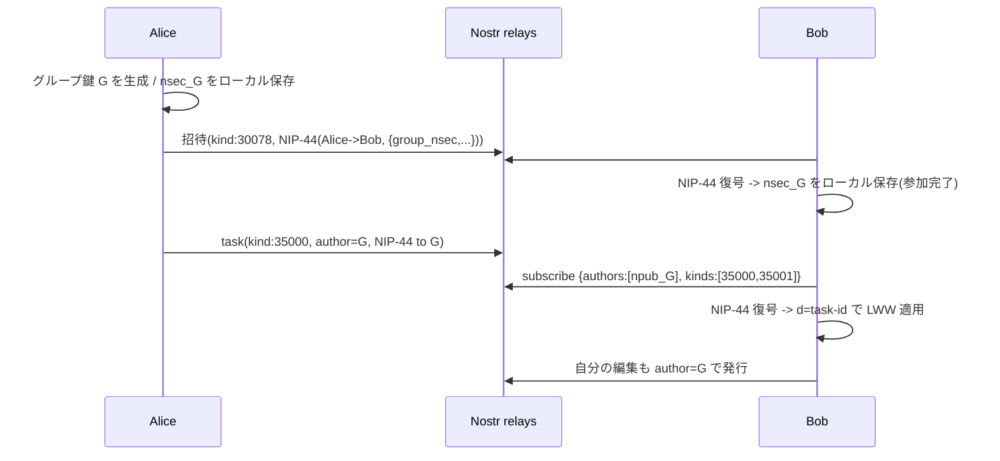

# Shared-Key Collaborative Lists Strategy

本ドキュメントは、MLS グループリストを廃し、共有鍵 + タスク単位 addressable event による
E2E 共同編集方式(`shared-v1`)へ移行する設計を定義する。

## 1. 目的と前提

- MLS(OpenMLS / Keychat fork)はチャット向けの重量級プロトコルであり、Key Package
  ライフサイクル・epoch・SQLite 永続化・Welcome 検証に起因するバグで Beta が停滞している。
- エコシステムは MLS/Marmot をチャット(White Noise / MDK / NIP-104)へ収斂させており、
  Todo 共有に forward secrecy / post-compromise security は過剰。
- 決定事項:
  - E2E は必須(リレー運営者はタスク内容を読めない)。
  - 当面は Meiso 同士で動けば十分(独自 kind + E2E 優先、標準化は後追い)。
  - 内部スキーマは将来の NIP-XXA(`kind:35000` Task)へ寄せ、移行差分を最小化する。

## 2. アーキテクチャ概要

共有リストごとに専用の Nostr 鍵 `G`(`nsec_G` / `npub_G`)を 1 つ生成する。`G` は

1. 共有タスクイベントの「署名者(author)」
2. タスク内容を NIP-44 自己暗号化する際の「鍵」

の両方を兼ねる。メンバーは `nsec_G` を共有することでリストに参加する。

```
Todo(JSON) --NIP-44 encrypt(to=G)--> content
          --addressable event(kind:35000, author=G, d=task-id)--> relays
```

- 同一 `(kind, author=G, d=task-id)` の replaceable 性により、タスク単位の
  Last-Write-Wins(LWW)が relay レベルで自動成立する。
- リレーから見えるのは「合成鍵 `G` が持つ d タグ(task-id)群とタイムスタンプ」のみ。
  `G` は誰の実 npub とも紐づかないため、ソーシャルグラフは漏れない。

### 2.1 MLS との対比

| 項目 | MLS(mls-v1) | 共有鍵(shared-v1) |
|------|-------------|-------------------|
| 状態管理 | Key Package / epoch / SQLite | なし(鍵を持つだけ) |
| 再インストール | 状態喪失でグループ消失 | `nsec_G` を復元すれば即復帰 |
| transport | kind 445 + listen key | kind 35000 addressable |
| 衝突解決 | アプリ側で action 適用 | relay の replaceable で LWW |
| forward secrecy | あり | なし(Todo 用途では許容) |
| メンバー除名 | MLS commit | 鍵ローテーション(後述) |
| 依存 | openmls/kc(keychat fork) | nostr-sdk のみ |

## 3. イベント仕様

### 3.1 タスクイベント(kind:35000, addressable)

```jsonc
{
  "kind": 35000,                 // addressable(30000-39999)。内部スキーマは NIP-XXA 準拠
  "pubkey": "<npub_G hex>",      // 共有鍵で署名
  "created_at": <unix>,          // LWW のタイブレークに使用
  "tags": [["d", "<task-uuid>"]],// 最小限。その他メタデータは content 内
  "content": "<NIP-44 v2 ciphertext>",
  "sig": "<G による署名>"
}
```

復号後の平文 payload(NIP-XXA フィールド名に準拠):

```jsonc
{
  "id": "<task-uuid>",
  "title": "Buy groceries",
  "status": "open",              // open | done  (NIP-XXB 準拠)
  "order": "0|hzzzz",            // fractional index(LexoRank系)
  "due": "2026-06-10T00:00:00Z", // 任意
  "list_id": "<group_id>",
  "parent_task_id": null,        // サブタスク(NIP-XXA parent 互換)
  "created_at": "...",
  "updated_at": "...",
  "deleted": false,              // トゥームストーン
  "editor_pubkey": "<実 npub hex>" // 任意。誰が最後に編集したかの内部記録(暗号化内なので非漏洩)
}
```

- 削除はイベント自体を消すのではなく `deleted:true` のトゥームストーンを再発行する
  (addressable なので relay 上で上書きされ、確実に伝播する)。
- 並べ替えは整数ではなく fractional index を用い、並行 reorder の衝突を回避する。

### 3.2 グループメタデータイベント(kind:35001, addressable)

リスト名・key_epoch・メンバー一覧(任意)を保持する。`G` 署名・NIP-44 自己暗号化。
`d` タグは固定値 `"meta"`。

```jsonc
// 復号後
{
  "name": "Shared Groceries",
  "key_epoch": 1,
  "members": ["<npub hex>", ...],  // 任意。表示用
  "updated_at": "..."
}
```

### 3.3 招待 / 鍵配布(Amber 互換)

`nsec_G` を招待先に安全に渡す。Amber モードでも動くよう、まずは NIP-44 封筒方式を採用する。

- 送信側(招待者の実鍵 or Amber で NIP-44 暗号化):
  - content = `NIP-44(inviter -> recipient, payload)`
  - payload = `{ "group_id", "group_nsec", "group_name", "key_epoch" }`
  - event = kind `30078`(既存の招待同期チャネルを踏襲), tags = `[["p", recipientHex], ["d", "shared-invite-{group_id}-{recipientHex}"]]`
- 受信側: `#p = self` の kind 30078 を取得し、`NIP-44(recipient -> inviter)` で復号して `nsec_G` を取り出す。

> メタデータ最小化(NIP-59 gift wrap 化)は後続の hardening とする。現状の MLS 実装でも
> `group_id` タグが平文露出している(ロードマップ Phase 9.3 で未対応)ため、本方式は
> 同等以上であり、E2E(内容秘匿)の要件は満たす。

## 4. データフロー



## 5. メンバー除名(鍵ローテーション)

forward secrecy が無いため、除名は鍵ローテーションで行う。

1. `key_epoch` を +1 し、新しい `G'` を生成。
2. 残存メンバーへ `G'` を NIP-44 封筒(§3.3)で再配布。
3. 全タスクを `G'` 署名で再発行(addressable なので上書き)。
4. 旧 `G` の購読を停止。除名されたメンバーは `G'` を受け取れないため以後の更新を読めない。

過去スナップショットは除名者が保持しうる(Todo 用途では許容)。

## 6. 実装マッピング

### Rust
- 新規 `rust/src/group_tasks_shared.rs`(純粋関数中心・ユニットテスト可能):
  - `generate_group_key() -> GroupKey { nsec_hex, npub_hex }`
  - `build_signed_task_event(group_nsec_hex, task_json) -> String`(NIP-44 暗号化 + kind:35000 署名済み JSON)
  - `decrypt_task_event(group_nsec_hex, event_json) -> String`(平文 task JSON)
  - `build_signed_meta_event` / `decrypt_meta_event`
  - `build_invitation_payload` / `parse_invitation_payload`
- `rust/src/api.rs` に FRB 公開ラッパを追加(`shared_*`)。
- 既存 `sign_event_with_ephemeral_key` / `send_signed_event` / `start_subscription_*` を再利用。
- `mls.rs` / `group_tasks_mls.rs` / openmls 依存は動作確認後に撤去。

### Flutter
- 新規 `lib/features/shared_list/`(domain / application / infrastructure)。
  - usecase: create / invite / accept / sync / rotateKey
  - `nsec_G` はセキュアに永続化(Hive + flutter_secure_storage 検討)。
- providers: `custom_lists_provider` / `todos_provider` / `nostr_provider` を `shared-v1` 対応へ。
- `lib/models/custom_list.dart`: `protocolVersion` に `shared-v1` と `protocolSharedV1` ヘルパを追加。

## 7. 移行方針

- 旧 MLS グループは PoC 段階で実ユーザー無し。`mls-v1` と `shared-v1` を一時並存させ、
  新規作成は `shared-v1` のみとする。
- 個人 Todo(kind:30001)は本タスクのスコープ外(現状維持)。
- 動作確認後に MLS 関連コードと openmls/kc 依存を削除する。

## 8. セキュリティ考慮

- `nsec_G` はグループの共有秘密であり、漏洩は当該リストの全内容露出に直結する。
  端末ローカルではセキュアストレージに保管し、ログ出力やネットワーク送出時は必ず NIP-44 で封緘する。
- 招待 payload の復号失敗は静かに無視せず、明示的にエラーを返す(silent failure 禁止)。
- LWW は同一 created_at で非決定になりうるため、タイブレークに `editor_pubkey` 等の
  決定的順序を併用する(実装時に明文化)。
